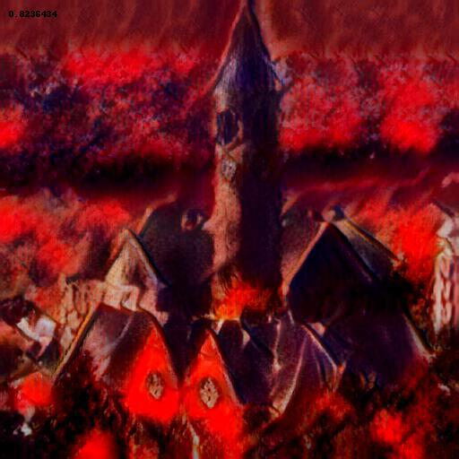
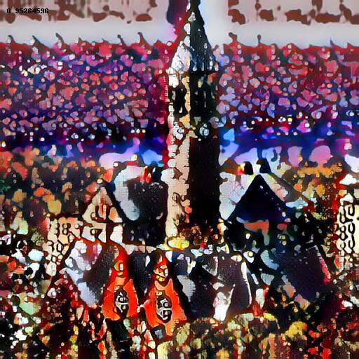

#

[Check out our paper]()

<p>
  <table>
    <tr>
           <td> Scary <br/>  </td>
           <td> Glomy <br/>  </td>
    </tr>
    <tr>
           <td> Peaceful <br/>  </td>
           <td> Happy <br/>  </td>
    </tr>
  </table>
</p>


### Requirments
* python2
* numpy
* scipy
* skimage
* pandas
* tensorflow
* keras
* tqdm 


### Demo

1. Download pretrained [models](https://yadi.sk/d/PXSo4UkN3WN35P).

2. Launch

```
python style_optimization_demo.py --image_shape 3,512,512 --adaptive_grad 1 --weight_image 10 --lr_decay 0.9 --score_type gloomy --number_of_iters 100 --alpha_sigma 0.25 --output_dir output/cornell_gloomy --content_image sup-mat/cornell_cropped.jpg
```

Check ```cmp.py``` for explanation of the command line arguments.

### Dataset

In this project 3 dataset are used:

1. [Lamem](http://memorability.csail.mit.edu/download.html). Put it to dataset/lamem. This dataset is needed for evaluation.

2. [Devian-art](https://www.dropbox.com/sh/3obloy1yp21izw3/AAC18wpp0Iuz6RHLzkfxEbt6a?dl=0). Put it to dataset/devian_art. This dataset is needed for training a gan, and baseline evaluation.

3. [BAM](https://bam-dataset.org/#download). Move .sqlite file to dataset/bam.sqlite. This dataset is needed for training predictors.

For downloading images use command:

```
python dataset/download_art_images.py --category emotion_scary
```

Filter the images:

```
python dataset/filter_corrupted_images.py --folder dataset/emotion_scary
```

Split in 2 datasets:

```
python dataset/split_dataset.py --folder dataset/emotion_scary
```


### Evaluation
Evaluation is the most time consuming part.

For baseline evaluation scary:

```
python evaluation.py --image_shape 3,256,256 --score_type scary --number_of_iters 500 --output_dir output/scary_baseline --method baseline --content_images_folder /path/to/lamem/dataset
```

For baseline evaluation memorability:

```
python evaluation.py --image_shape 3,256,256 --score_type mem --number_of_iters 500 --output_dir output/mem_baseline --method baseline --content_images_folder /path/to/lamem/dataset
```

For BAE evaluation scary:

```
python evaluation.py --image_shape 3,256,256 --score_type scary --number_of_iters 500 --output_dir output/scary_bae --method langevin --content_images_folder /path/to/lamem/dataset --alpha_sigma 0 --adaptive_grad 1 --weight_image 10 --lr_decay 0.9
```

For BAE evaluation memorability:

```
python evaluation.py --image_shape 3,256,256 --score_type mem --number_of_iters 500 --output_dir output/mem_bae --method langevin --content_images_folder /path/to/lamem/dataset --alpha_sigma 0 --weight_image 100
```

For A-BAE evaluation scary:

```
python evaluation.py --image_shape 3,256,256 --score_type scary --number_of_iters 500 --output_dir output/scary_bae --method langevin --content_images_folder /path/to/lamem/dataset --alpha_sigma 0.25 --adaptive_grad 1 --weight_image 10 --lr_decay 0.9
```

For A-BAE evaluation memorability: 

```
python evaluation.py --image_shape 3,256,256 --score_type mem --number_of_iters 500 --output_dir output/mem_bae --method langevin --content_images_folder /path/to/lamem/dataset --alpha_sigma 0.25 --weight_image 100
```


### Training

1. Training a gan. After downloading devian_art simply run:

```
python style_gan_train.py --input_dir dataset/devian_art --cache_file_name output/devian_art.npy
```

2. Traing a predictor:
For memorability predictor refer to (https://github.com/AliaksandrSiarohin/mem-transfer) and convert to keras using https://github.com/AliaksandrSiarohin/caffe2keras .

For aestetics predictor download it from (https://github.com/BestiVictory/ILGnet) and convert usign https://github.com/AliaksandrSiarohin/caffe2keras .

For emotion predictors download images from BAM (see dataset section) and 2 train 2 predictors with following commands:

```
python train_predictor.py --dataset_train dataset/emotion_scary/internal --dataset_val dataset/emotion_scary/external --checkpoint_nam models/scary_internal.h5
```

```
python train_predictor.py --dataset_train dataset/emotion_scary/external --dataset_val dataset/emotion_scary/internal --checkpoint_nam models/scary_external.h5
```

3. Style transfer model can be downloaded from https://github.com/xunhuang1995/AdaIN-style and converted using https://github.com/AliaksandrSiarohin/pytorch2keras .


